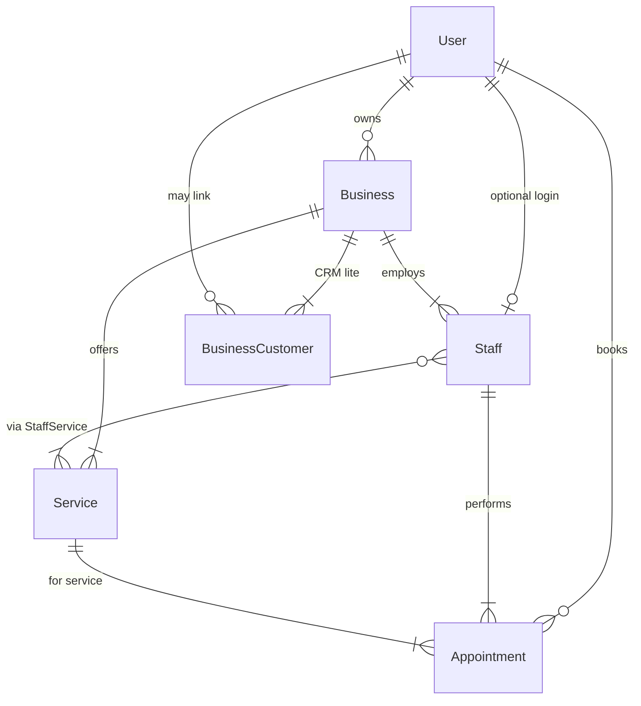

# Veri modeli taslağı (ER mantığı)

Bu belge MVP için **varlıklar, alanlar ve ilişkileri** tanımlar. Django modellerine bire bir kopya değildir; uygulama sırasında isimlendirme ve normalizasyon backend ekibince netleştirilir.

**İsimlendirme:** API ve JSON tarafında `snake_case` alan adları; tablo adları çoğul (ör. `appointments`) tercih edilebilir.

---

## 1. ER diyagramı (metin)



---

## 2. Varlıklar ve alanlar

### 2.1 `User` (kimlik)

Django `AbstractUser` genişletmesi veya e-posta tabanlı özel kullanıcı modeli ile uyumlu düşünülür.

| Alan | Tip | Zorunlu | Açıklama |
|------|-----|---------|----------|
| `id` | UUID veya BigInt PK | evet | Dahili kimlik |
| `email` | string, unique | evet | Giriş ve iletişim |
| `password_hash` | string | evet | Framework tarafından |
| `full_name` | string | evet | Görünen ad |
| `phone` | string | önerilir | SMS / hatırlatma |
| `role` | enum | evet | `customer`, `business_admin`, `staff` |
| `is_active` | bool | evet | Hesap durumu |
| `created_at` | datetime | evet | |

**Not:** `staff` rolü, `Staff` kaydı ile bir `User` satırını ilişkilendirir; personelin sisteme girişi yoksa `Staff.user_id` boş kalabilir (ürün kararı).

---

### 2.2 `Business` (işletme)

| Alan | Tip | Zorunlu | Açıklama |
|------|-----|---------|----------|
| `id` | PK | evet | |
| `owner_id` | FK → User | evet | İşletme yetkilisi |
| `name` | string | evet | Görünen ad |
| `slug` | string, unique | önerilir | URL / paylaşım |
| `category` | enum | evet | `barber`, `hair_salon`, `beauty_center` (genişletilebilir) |
| `description` | text | hayır | |
| `address_line` | string | evet | |
| `city` | string | evet | Filtreleme |
| `district` | string | önerilir | |
| `latitude` | decimal | önerilir | Yakınlık sorgusu |
| `longitude` | decimal | önerilir | |
| `working_hours` | JSON | evet | Haftalık şablon (bkz. §4) |
| `timezone` | string | önerilir | Örn. `Europe/Istanbul` |
| `is_active` | bool | evet | Yayında mı |
| `created_at` / `updated_at` | datetime | evet | |

---

### 2.3 `Service` (hizmet)

İşletmeye bağlı katalog satırı; süre slot hesabının temelidir.

| Alan | Tip | Zorunlu | Açıklama |
|------|-----|---------|----------|
| `id` | PK | evet | |
| `business_id` | FK → Business | evet | |
| `name` | string | evet | Örn. Saç kesimi |
| `duration_minutes` | int | evet | > 0 |
| `price` | decimal | evet | Para birimi ürün kararı (TRY) |
| `is_active` | bool | evet | Menüden kaldırma |

---

### 2.4 `Staff` (personel)

| Alan | Tip | Zorunlu | Açıklama |
|------|-----|---------|----------|
| `id` | PK | evet | |
| `business_id` | FK → Business | evet | |
| `user_id` | FK → User, nullable | hayır | Girişli personel |
| `display_name` | string | evet | Müşteriye görünen ad |
| `working_hours` | JSON, nullable | hayır | Yoksa işletme saatleri geçerli (bkz. §4) |
| `is_active` | bool | evet | |

---

### 2.5 `StaffService` (personel ↔ hizmet)

Hangi personelin hangi hizmeti verebildiği; çoktan çoğa ilişki.

| Alan | Tip | Zorunlu | Açıklama |
|------|-----|---------|----------|
| `staff_id` | FK | evet | |
| `service_id` | FK | evet | |
| `duration_minutes_override` | int, nullable | hayır | Bu personelde farklı süre |
| `is_active` | bool | evet | |

Birleşik benzersiz anahtar: (`staff_id`, `service_id`).

---

### 2.6 `Appointment` (randevu)

| Alan | Tip | Zorunlu | Açıklama |
|------|-----|---------|----------|
| `id` | PK | evet | |
| `business_id` | FK → Business | evet | Denormalizasyon / sorgu kolaylığı |
| `customer_id` | FK → User | evet | Müşteri |
| `staff_id` | FK → Staff | evet | |
| `service_id` | FK → Service | evet | |
| `starts_at` | datetime (TZ) | evet | Başlangıç |
| `ends_at` | datetime (TZ) | evet | `starts_at + effective_duration` ile tutarlı |
| `status` | enum | evet | `pending`, `confirmed`, `completed`, `cancelled`, `no_show` |
| `source` | enum | evet | `customer_app`, `business_manual` |
| `customer_note` | text | hayır | Müşteri notu |
| `internal_note` | text | hayır | Sadece işletme paneli |
| `created_at` / `updated_at` | datetime | evet | |

**İş kuralı:** Aynı `staff_id` için `[starts_at, ends_at)` aralıkları, `status = cancelled` hariç kesişmemeli.

**Süre:** Etkin süre = `StaffService.duration_minutes_override` varsa o, yoksa `Service.duration_minutes`.

---

### 2.7 `BusinessCustomer` (işletme müşteri rehberi — CRM lite)

Müşteri her zaman `User` olmayabilir (walk-in); opsiyonel bağ.

| Alan | Tip | Zorunlu | Açıklama |
|------|-----|---------|----------|
| `id` | PK | evet | |
| `business_id` | FK | evet | |
| `user_id` | FK → User, nullable | hayır | Uygulama kullanıcısı ise |
| `display_name` | string | evet | |
| `phone` | string | önerilir | |
| `email` | string | hayır | |
| `notes` | text | hayır | |
| `created_at` | datetime | evet | |

Manuel randevuda `customer_id` yerine veya ek olarak `business_customer_id` kullanımı ileride netleştirilebilir; MVP’de randevu `customer_id` (User) üzerinden gidecekse, manuel akışta hızlı “misafir” kullanıcı oluşturma stratejisi backend’de tanımlanır.

---

## 3. İlişki özeti

| İlişki | Tür |
|--------|-----|
| User → Business | 1:N (`owner`) |
| Business → Service, Staff | 1:N |
| Staff ↔ Service | N:M (`StaffService`) |
| User → Appointment | 1:N (müşteri) |
| Staff / Service → Appointment | N:1 |
| Business → Appointment | N:1 (denormalize) |

---

## 4. `working_hours` JSON şeması (MVP)

Tek tip şema hem `Business.working_hours` hem `Staff.working_hours` için kullanılabilir. Personelde `null` ise işletme saatleri uygulanır.

```json
{
  "monday":    { "open": "09:00", "close": "19:00", "closed": false, "breaks": [{ "start": "12:30", "end": "13:30" }] },
  "tuesday":   { "open": "09:00", "close": "19:00", "closed": false, "breaks": [] },
  "wednesday": { "closed": true },
  "thursday":  { "open": "09:00", "close": "19:00", "closed": false, "breaks": [] },
  "friday":    { "open": "09:00", "close": "19:00", "closed": false, "breaks": [] },
  "saturday":  { "open": "10:00", "close": "18:00", "closed": false, "breaks": [] },
  "sunday":    { "closed": true }
}
```

Gün anahtarları sabit (`monday` … `sunday`). Validasyon backend’de yapılır.

---

## 5. Enum değerleri (özet)

| Alan | Değerler |
|------|----------|
| `User.role` | `customer`, `business_admin`, `staff` |
| `Business.category` | `barber`, `hair_salon`, `beauty_center` |
| `Appointment.status` | `pending`, `confirmed`, `completed`, `cancelled`, `no_show` |
| `Appointment.source` | `customer_app`, `business_manual` |

---

## 6. Revizyon

Bu tasarım **Faz 1** Django modelleri yazılırken güncellenir. Değişiklikler `API-CONTRACT.md` ile uyumlu tutulmalıdır.

---

*Son güncelleme: Nisan 2026*
